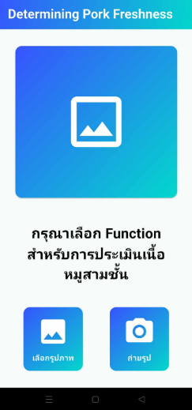
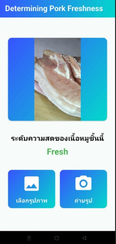
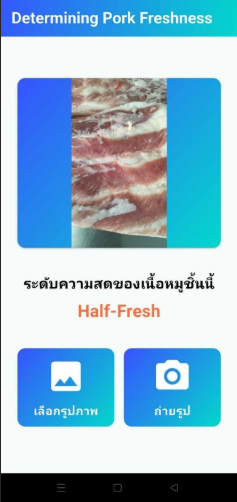
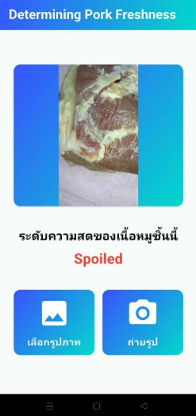

# Determining Pork Freshness

แอปพลิเคชันสำหรับตรวจสอบและจำแนกระดับความสดของเนื้อหมูสามชั้น (Pork Belly) ซึ่งเป็นส่วนหนึ่งของปริญญานิพนธ์ (โครงงานจบการศึกษา) ตัวแอปพลิเคชันพัฒนาด้วย **Flutter** และขับเคลื่อนด้วยโมเดล **Deep Learning** ที่ถูกฝึกสอน (Train) ด้วยชุดข้อมูลภาพถ่ายเนื้อหมูสามชั้นที่จัดเก็บโดยเฉพาะ เพื่อให้ได้ความแม่นยำสูงสุดในการประเมินคุณภาพของเนื้อหมู

## ตัวอย่างแอปพลิเคชัน

  
  
  
  

## วัตถุประสงค์ของโครงงาน (Objectives)

1. เพื่อจำแนกความสดของเนื้อหมูสามชั้นออกเป็น 3 ระดับ ได้แก่ **เนื้อสด (Fresh)**, **เนื้อเก่า (Old)** และ **เนื้อเสีย (Spoiled)**
2. เพื่อนำเทคโนโลยีการแยกสีด้วยระบบ **HSV (Hue, Saturation, Value)** และ **Deep Learning** มาประยุกต์ใช้ในการจำแนกความสดของเนื้อหมูสามชั้นอย่างมีประสิทธิภาพ

## ขอบเขตของโครงงาน (Scope)

### ด้านระบบ (System)
* **Dataset:** ใช้ข้อมูลภาพถ่ายเนื้อหมูที่จัดเก็บด้วยตนเอง โดยเน้นไปที่ส่วนของ **"เนื้อหมูสามชั้น"** ในการฝึกสอนโมเดล (Train Model)
* **Image Processing:** ใช้เทคนิคการแปลงพื้นที่สี (Color Space) จากระบบสี **RGB ให้เป็น HSV** เพื่อสกัดคุณลักษณะ (Features) ที่บ่งบอกความสดของเนื้อ
* **Classification:** สามารถแยกระดับความสดของเนื้อหมูสามชั้นจากรูปภาพได้ **3 ระดับ** คือ:
  1. เนื้อหมูสามชั้นสด (Fresh)
  2. เนื้อหมูสามชั้นเก่า (Old)
  3. เนื้อหมูสามชั้นเสีย (Spoiled)
* **Environment Control:** ข้อมูลภาพถ่ายถูกควบคุมสภาพแวดล้อมของแสง โดยใช้แสงจากหลอดไฟ LED ที่มีค่าความสว่างระหว่าง **645 ถึง 1102 ลักซ์ (Lux)** และใช้อุณหภูมิสีของแสงอยู่ระหว่าง **5,500 – 6,500 เคลวิน (Kelvin)**

### ด้านผู้ใช้งาน (User)
* ผู้ใช้งานสามารถนำเข้ารูปภาพเนื้อหมูสามชั้นเพื่อตรวจสอบความสดได้ 2 ช่องทาง คือ:
  1. ถ่ายภาพใหม่ผ่าน **กล้องถ่ายรูป (Camera)** ของสมาร์ทโฟน
  2. เลือกรูปภาพจาก **คลังรูปภาพ (Gallery)** ในตัวเครื่อง

---

## เทคโนโลยีที่ใช้ (Technologies & Tools)

* **Frontend / Mobile App:** Flutter (Dart)
* **Machine Learning:** Deep Learning Model (Custom trained)
* **Image Processing:** RGB to HSV Color Conversion

---

## Getting Started (การติดตั้งและใช้งานเบื้องต้น)

โปรเจคนี้พัฒนาด้วย Flutter หากคุณเพิ่งเริ่มต้นใช้งาน Flutter สามารถศึกษาเพิ่มเติมได้จากแหล่งข้อมูลเหล่านี้:

- [Lab: Write your first Flutter app](https://docs.flutter.dev/get-started/codelab)
- [Cookbook: Useful Flutter samples](https://docs.flutter.dev/cookbook)

สำหรับการเริ่มต้นใช้งานและรันโปรเจคนี้:
1. โคลน (Clone) โปรเจคนี้ลงในเครื่องของคุณ
2. รันคำสั่ง `flutter pub get` เพื่อติดตั้ง Dependencies ทั้งหมด
3. รันคำสั่ง `flutter run` เพื่อทดสอบแอปพลิเคชันบน Emulator หรืออุปกรณ์จริง

สำหรับข้อมูลเพิ่มเติมเกี่ยวกับการพัฒนา Flutter สามารถดูได้ที่ [online documentation](https://docs.flutter.dev/) ซึ่งมีทั้ง Tutorials, Samples และ API Reference แบบครบถ้วน